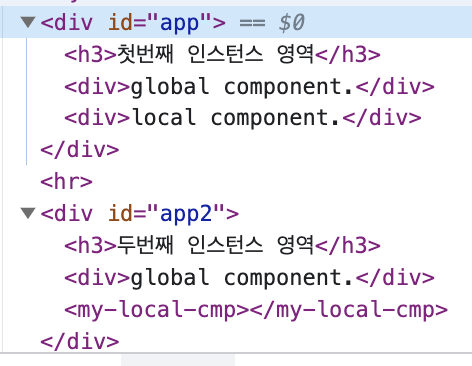

## Global Component
    

        <button>컴포넌트 등록</button>
        <my-component></my-component>
    

    Vue.component('my-component',{
        template: '
전역 컴포넌트
'
    });
    new Vue({
        el: '#app'
    });

## Local Component
    

        <my-local-component></my-local-component>
    

    var cmp = {
        template: '
지역 컴포넌트
'
    };

    new Vue({
        el: '#app',
        components: {
        'my-local-component': cmp
        }
    });
## Scope
- 전역 컴포넌트는 인스턴스를 새로 생성할 때마다 인스턴스에 components속성으로 등록할 필요 없이 한 번 등록하면 어느 인스턴스에서든지 사용할 수 있다.
- 반대로, 지역 컴포넌트는 새 인스턴스를 생성할 때마다 등록해 줘야 한다.

